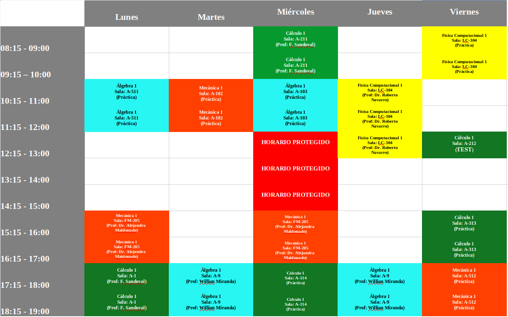

# ⏰📅 Horario Mechones – Ciencias Físicas UdeC

## ⏱️ Horario oficial
El horario de clases del primer semestre 2026  se encuentra en la siguiente imagen 👇

🖼️ **Horario:**  

*(Si no se visualiza correctamente, asegúrate de abrir la imagen directamente desde el repositorio)*

---

## 👋 ¡Bienvenidos/as!

¡Hola! 🙌  
Este repositorio fue creado **únicamente** para compartir de forma clara y ordenada el **horario de actividades para mechones** de **Ciencias Físicas** ✨📐.

La idea es que puedan:
- 📱 Revisar el horario fácilmente  
- 🔄 Tener siempre la versión actualizada  
- ❓ Evitar confusiones de días u horarios  

No hay más contenido aquí (por ahora 😉):  
👉 **este repo existe solo para el horario**.

---

## ℹ️ Nota
Si el horario cambia, la imagen será actualizada en este mismo repositorio, así que pueden revisarlo cuando lo necesiten 👀📌, o preguntar por el grupo.

¡Mucho ánimo en este inicio de semestre! 💪🔥
